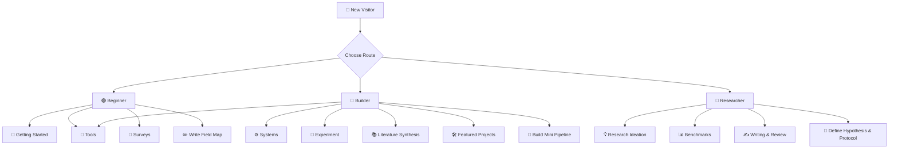

<h1 align="center">Vibe Research Guide</h1>

<p align="center">
  <em>一个面向 <strong>Vibe Research</strong> 的精选入门资料包与研究索引<br>聚焦 LLM Agent 在科学发现、研究构思、文献综合、实验执行与科研评测中的代表性工作</em>
</p>

<p align="center">
  <a href="https://github.com/SpectrAI-Initiative/Vibe-Research-Guide/stargazers"></a>
  <a href="https://github.com/SpectrAI-Initiative/Vibe-Research-Guide/commits/main"></a>
  <a href="https://github.com/SpectrAI-Initiative/Vibe-Research-Guide/issues"></a>
  
</p>

<p align="center">
  <strong><a href="https://htmlpreview.github.io/?https://raw.githubusercontent.com/SpectrAI-Initiative/Vibe-Research-Guide/main/index.html">🌐 View Interactive Multilingual README →</a></strong><br>
  <small>🇨🇳 中文 · 🇺🇸 English · 🇰🇷 한국어 · 🇯🇵 日本語 · 🇩🇪 Deutsch · 🇫🇷 Français · 🇪🇸 Español · 🇮🇹 Italiano · 🇵🇹 Português · 🇸🇦 العربية · 🇹🇭 ไทย · 🇻🇳 Tiếng Việt · 🇷🇺 Русский</small>
</p>

---

### 📢 News｜项目进展

🔥 *2026-W13: 内容大幅扩充——新增 Getting Started、Tools、Experiment、Writing & Review 四大板块，论文覆盖从 14 篇增至 30+ 篇*<br>
🔄 *2026-W12: 项目结构重组织，采用 hub-and-spoke 架构*<br>
🚀 *2026-W12: Vibe Research Guide 正式开源*

---

<section id="start"></section>

## 🐣 (1) Start From Here - 从这里开始

### (1.1) What is Vibe Research - 什么是 Vibe Research

**EN**: Vibe Research studies how LLM-based agents can support or automate the full research loop: finding ideas, planning experiments, writing code, synthesizing literature, and validating scientific insights.

**中文**：Vibe Research 关注 LLM Agent 如何支持或自动化完整科研流程——从 idea 发现、实验规划与实现，到文献综合和科研结论验证。

### (1.2) How to Use This Guide - 如何使用这份指南

本指南以**百科全书 + 路线卡片**的形式组织，服务两类读者：

- **想上手的人**：通过 [Getting Started](#getting-started) 和 [Tools](#tools) 快速体验并使用 Vibe Research
- **做研究的人**：通过 [Surveys](#surveys) ~ [Benchmarks](#benchmarks) 系统跟踪领域最新进展

设计理念：

1. **先建认知**：通过综述类论文快速建立领域全局框架
2. **再选路线**：根据你的目标（入门 / 构建 / 研究）选择一条聚焦的阅读路线
3. **后续深入**：通过各 `topics/` 子页面获取详细论文解读、工具推荐和延伸阅读

README 是索引中心，详细内容在 [`topics/`](./topics/) 目录下的各主题文件中。

### (1.3) Who is This For - 适合谁

- **新手**：希望系统入门 AI 科研 Agent 的初学者 → 从 [(3) Getting Started](#getting-started) 开始
- **研究生**：寻找论文阅读方向和项目选题的学生 → 从 [(6) Surveys](#surveys) 开始
- **开发者**：希望构建研究助手或自主科研系统原型的 Builder → 从 [(4) Tools](#tools) 开始
- **研究者**：跟踪 Vibe Research 领域最新进展 → 从 [(8) Ideation](#ideation) 开始

<a href="https://github.com/SpectrAI-Initiative/Vibe-Research-Guide/graphs/contributors">
  
</a>

---

<section id="quickstart"></section>

## ⚡ (2) 30-Second Quickstart - 30 秒快速入门

> 如果今天只有 30 分钟：阅读论文 **#1 + #4 + #12**。

1. 从**推荐阅读路径**开始，完成前 3 篇综述
2. 从**系统 / 构思 / 评测**中选择一个方向，深入阅读 2 篇论文
3. 使用 [Resource Suggestion](https://github.com/SpectrAI-Initiative/Vibe-Research-Guide/issues/new?template=resource_suggestion.yml) 模板提交 Issue，分享缺失的论文或工具

### 推荐阅读路径（核心论文）

| 顺序 | 论文 | 类别 |
|---|---|---|
| 1 | [From Automation to Autonomy](https://arxiv.org/abs/2505.13259) | Survey |
| 2 | [LLM Agents as AI Scientists](https://openreview.net/pdf?id=bfdUWy6rUA) | Survey |
| 3 | [A Survey of LLM-based Scientific Agents](https://arxiv.org/abs/2503.24047) | Survey |
| 4 | [The AI Scientist](https://arxiv.org/abs/2408.06292) | System |
| 5 | [The AI Scientist-v2](https://arxiv.org/abs/2504.08066) | System |
| 6 | [Agent Laboratory](https://arxiv.org/abs/2501.04227) | System |
| 7 | [ResearchAgent](https://arxiv.org/abs/2404.07738) | Ideation |
| 8 | [Can LLMs Generate Novel Research Ideas?](https://arxiv.org/abs/2409.04109) | Ideation |
| 9 | [OpenScholar](https://arxiv.org/abs/2411.14199) | Synthesis |
| 10 | [PaperQA2](https://arxiv.org/abs/2312.07559) | Synthesis |
| 11 | [ScienceAgentBench](https://arxiv.org/abs/2410.05080) | Benchmark |
| 12 | [RE-Bench](https://arxiv.org/abs/2411.15671) | Benchmark |

### 路线卡片

根据目标选择一条路线，每条路线提供聚焦的论文栈和实用下一步行动。

<details>
<summary><b>🟢 入门路线 Beginner Route</b> — 一个周末建立领域心智模型</summary>

- **Start with**: [Getting Started 上手指南](./topics/getting-started.md) → 体验零代码工具
- **Then read**: [From Automation to Autonomy](https://arxiv.org/abs/2505.13259) → [LLM Agents as AI Scientists](https://openreview.net/pdf?id=bfdUWy6rUA) → [The AI Scientist](https://arxiv.org/abs/2408.06292)
- **Next action**: 写一页总结：`problem → agent role → evaluation`
- **Jump to**: [上手指南](#getting-started) · [工具篇](#tools) · [综述篇](#surveys)

</details>

<details>
<summary><b>🔵 构建者路线 Builder Route</b> — 从阅读过渡到构建研究助手原型</summary>

- **Start with**: [Tools 工具篇](./topics/tools.md) → 选择工具栈
- **Then read**: [The AI Scientist](https://arxiv.org/abs/2408.06292) → [OpenHands](https://arxiv.org/abs/2407.16741) → [PaperQA2](https://arxiv.org/abs/2312.07559)
- **Next action**: 实现最小 pipeline：`retrieve papers → draft idea → run tiny experiment → summarize`
- **Jump to**: [工具篇](#tools) · [系统篇](#systems) · [实验篇](#experiment) · [精选项目](#featured)

</details>

<details>
<summary><b>🔴 研究者路线 Researcher Route</b> — 设计可发表的研究问题并严格评估</summary>

- **Start with**: [ResearchAgent](https://arxiv.org/abs/2404.07738) → [Can LLMs Generate Novel Research Ideas?](https://arxiv.org/abs/2409.04109) → [Nova](https://arxiv.org/abs/2410.14255)
- **Evaluate with**: [ScienceAgentBench](https://arxiv.org/abs/2410.05080) · [RE-Bench](https://arxiv.org/abs/2411.15671)
- **Write with**: [论文撰写与审稿篇](./topics/writing-review.md)
- **Next action**: 定义一个假设 + 一个 benchmark-backed 评测方案
- **Jump to**: [构思篇](#ideation) · [评测篇](#benchmarks) · [撰写与审稿篇](#writing)

</details>

### 可视化路线图



### 图例 Legend

- **推荐度**：`★★★★★` must-read · `★★★★☆` 强烈推荐
- **阶段**：`Beginner` 入门 · `Beginner-Intermediate` 过渡 · `Intermediate` 进阶

---

<section id="getting-started"></section>

## 🚀 (3) Getting Started - 上手实践指南

> 面向零基础或传统研究背景的读者，帮助你在最短时间内理解并上手 Vibe Research。

- [完整上手指南：从零代码体验到 30 分钟动手项目 →](./topics/getting-started.md)

| 路线 | 时间 | 前置要求 | 你会获得 |
|---|---|---|---|
| 零代码体验 | 5 分钟 | 浏览器 | 体验 AI 文献调研与 idea brainstorm |
| 轻代码入门 | 30 分钟 | Python + API key | 运行你的第一个 Research Agent |
| 7 天学习路径 | 1 周 | 同上 | 系统理解 + 独立实践能力 |

---

<section id="tools"></section>

## 🧰 (4) Practical Tools - 实用工具与平台

> 从零代码的 AI 搜索引擎到可部署的开源 Agent 框架，帮你快速找到适合自己工作流的工具组合。

- [完整工具列表与选型指南 →](./topics/tools.md)

| 环节 | 代表工具 | 特点 |
|---|---|---|
| 文献发现 | Semantic Scholar · Connected Papers · Research Rabbit | 免费，AI 驱动 |
| 文献阅读 | Elicit · Consensus · NotebookLM | 零代码，对话式 |
| Agent 框架 | AI-Scientist · PaperQA2 · OpenHands | 开源，可部署 |
| 写作辅助 | Writefull · Paperpal | 学术场景优化 |
| 实验代码 | Cursor · GitHub Copilot · W&B | AI 编码 + 实验跟踪 |

---

<section id="useful-info"></section>

## 📄 (5) Useful Info - 有利于搭建认知的资料

这一章用于**快速建立对 Vibe Research 领域的整体认知**，适合在系统阅读论文之前用来了解技术版图、社区生态与研究脉络。

**方向性与入门资料**

| 资源 | 链接 | 说明 |
|---|---|---|
| AI for Science (Nature, 2023) | [paper](https://www.nature.com/articles/s41586-023-06221-2) | AI for Science 领域的高层综述 |
| Lilian Weng: LLM Powered Autonomous Agents | [blog](https://lilianweng.github.io/posts/2023-06-23-agent/) | 经典 Agent 系统博文 |
| Andrew Ng: Agentic Design Patterns | [blog](https://www.deeplearning.ai/the-batch/how-agents-can-improve-llm-performance/) | Agent 设计模式入门 |

**高质量会议与期刊（论文检索重点关注）**

NeurIPS · ICML · ICLR · ACL · AAAI · EMNLP · NAACL · Nature · Science

**长期跟进研究进展**

| 资源 | 链接 | 说明 |
|---|---|---|
| Awesome LLM-based Autonomous Agent | [repo](https://github.com/Paitesanshi/LLM-Agent-Survey) | LLM Agent 综述配套论文列表 |
| Awesome AI Agents | [repo](https://github.com/e2b-dev/awesome-ai-agents) | AI Agent 工具与项目集合 |
| Awesome Scientific Idea Generation | [repo](https://github.com/wjie0309/awesome-scientific-idea-generation) | 科研 idea 生成方向论文 |
| Papers with Code: AI for Science | [website](https://paperswithcode.com/task/ai-for-science) | AI for Science 论文与代码索引 |
| Semantic Scholar | [website](https://www.semanticscholar.org/) | AI 驱动的科学文献搜索引擎 |
| Connected Papers | [website](https://www.connectedpapers.com/) | 论文关系图谱可视化工具 |

---

<section id="surveys"></section>

## 📄 (6) Surveys - 综述篇

> 综述帮助你在最短时间内建立全局框架：从 LLM 在科学发现中的演化，到 AI Scientist 的完整生命周期，再到系统设计与评测。

- [完整论文列表、阅读建议与延伸阅读 →](./topics/surveys.md)

| # | Paper | Type | Stage |
|---|---|---|---|
| 1 | [From Automation to Autonomy: A Survey on LLMs in Scientific Discovery](https://arxiv.org/abs/2505.13259) | Survey | Beginner |
| 2 | [LLM Agents as AI Scientists: A Survey](https://openreview.net/pdf?id=bfdUWy6rUA) | Survey | Beginner |
| 3 | [A Survey of LLM-based Scientific Agents](https://arxiv.org/abs/2503.24047) | Survey | Beginner-Intermediate |
| 4 | [The Landscape of Emerging AI Agent Architectures](https://arxiv.org/abs/2404.11584) | Survey | Beginner-Intermediate |
| 5 | [A Survey on LLM-based Autonomous Agents](https://arxiv.org/abs/2308.11432) | Survey | Beginner |

---

<section id="systems"></section>

## ⚙️ (7) Representative Systems - 代表系统篇

> 代表性系统展示了 LLM Agent 如何端到端地参与科学研究：idea → experiment → paper → review。理解它们的架构是理解整个领域的基础。

- [完整论文列表、系统对比与延伸阅读 →](./topics/systems.md)

| # | Paper | Type | Stage |
|---|---|---|---|
| 1 | [The AI Scientist: Towards Fully Automated Scientific Discovery](https://arxiv.org/abs/2408.06292) | System | Intermediate |
| 2 | [The AI Scientist-v2: Workshop-Level Automated Scientific Discovery](https://arxiv.org/abs/2504.08066) | System | Intermediate |
| 3 | [Agent Laboratory: Using LLM Agents as Research Assistants](https://arxiv.org/abs/2501.04227) | System | Intermediate |
| 4 | [SWE-agent: Agent-Computer Interfaces for Software Engineering](https://arxiv.org/abs/2405.15793) | System | Intermediate |
| 5 | [OpenHands: An Open Platform for AI Software Engineers](https://arxiv.org/abs/2407.16741) | Platform | Intermediate |

---

<section id="ideation"></section>

## 💡 (8) Research Ideation - 研究构思篇

> Research Ideation 关注 LLM 能否帮助研究者发现新 idea：从文献中找 gap、迭代生成 idea、评估 novelty 和 feasibility。

- [完整论文列表、方法对比与延伸阅读 →](./topics/ideation.md)

| # | Paper | Type | Stage |
|---|---|---|---|
| 1 | [ResearchAgent: Iterative Research Idea Generation](https://arxiv.org/abs/2404.07738) | Ideation | Intermediate |
| 2 | [Can LLMs Generate Novel Research Ideas?](https://arxiv.org/abs/2409.04109) | Evaluation | Intermediate |
| 3 | [Chain of Ideas: Revolutionizing Research Via Novel Idea Development](https://arxiv.org/abs/2410.13185) | Ideation | Intermediate |
| 4 | [Scideator: Human-LLM Scientific Idea Generation](https://arxiv.org/abs/2409.14634) | Human-LLM | Intermediate |
| 5 | [AI-Researcher: Multi-Agent Scientific Discovery](https://arxiv.org/abs/2404.04573) | Ideation | Intermediate |
| 6 | [Nova: Enhancing Novelty and Diversity of LLM Ideas](https://arxiv.org/abs/2410.14255) | Ideation | Intermediate |

---

<section id="synthesis"></section>

## 📚 (9) Literature Synthesis - 文献综合篇

> Literature Synthesis 关注如何让 LLM 系统性地阅读、理解和综合大量科学文献，生成有引用支撑的综合性回答。

- [完整论文列表、工具生态与延伸阅读 →](./topics/synthesis.md)

| # | Paper | Type | Stage |
|---|---|---|---|
| 1 | [OpenScholar: Synthesizing Scientific Literature with RAG](https://arxiv.org/abs/2411.14199) | RAG / Synthesis | Intermediate |
| 2 | [PaperQA: RAG Agent for Scientific Research](https://arxiv.org/abs/2312.07559) | RAG / QA | Beginner-Intermediate |
| 3 | [AutoSurvey: LLMs Can Automatically Write Surveys](https://arxiv.org/abs/2406.10252) | Survey Generation | Intermediate |
| 4 | [ScholarCopilot: RAG for Academic Writing](https://arxiv.org/abs/2504.00824) | RAG / Writing | Intermediate |
| 5 | [RA-ISF: Iterative Self-Feedback for RAG](https://arxiv.org/abs/2403.06840) | RAG / Reasoning | Intermediate |

---

<section id="experiment"></section>

## 🧪 (10) Experiment Execution - 实验设计与执行篇

> 关注 LLM Agent 如何自动化实验：设计实验方案、编写代码、运行分析、解读结果。

- [完整论文列表、方法对比与延伸阅读 →](./topics/experiment.md)

| # | Paper | Type | Stage |
|---|---|---|---|
| 1 | [MLAgentBench: Evaluating Agents on ML Experimentation](https://arxiv.org/abs/2310.03302) | Benchmark + Agent | Intermediate |
| 2 | [Data Interpreter: An LLM Agent for Data Science](https://arxiv.org/abs/2402.18679) | System | Intermediate |
| 3 | [OpenHands: Open Platform for AI Software Engineers](https://arxiv.org/abs/2407.16741) | Platform | Intermediate |
| 4 | [SWE-agent: Agent-Computer Interfaces](https://arxiv.org/abs/2405.15793) | System | Intermediate |

---

<section id="writing"></section>

## ✍️ (11) Writing & Review - 论文撰写与审稿篇

> 关注 LLM 如何辅助科学论文写作、结构组织、自动化审稿与反馈。

- [完整论文列表、方法对比与延伸阅读 →](./topics/writing-review.md)

| # | Paper | Type | Stage |
|---|---|---|---|
| 1 | [Can LLMs Provide Useful Feedback on Research Papers?](https://arxiv.org/abs/2310.01783) | Evaluation | Intermediate |
| 2 | [MARG: Multi-Agent Review Generation](https://arxiv.org/abs/2401.04259) | System | Intermediate |
| 3 | [SciMON: Scientific Inspiration Machines for Novelty](https://arxiv.org/abs/2305.14259) | System | Intermediate |
| 4 | [Paper SEA: Standardization, Evaluation, Analysis](https://arxiv.org/abs/2407.12857) | Benchmark | Intermediate |

---

<section id="benchmarks"></section>

## 📊 (12) Benchmark & Evaluation - 评测篇

> 没有严格评测，我们无法判断 research agent 是否真正"做了科学发现"。本篇关注评测任务设计、能力度量与可验证的科学发现。

- [完整论文列表、Benchmark 对比与延伸阅读 →](./topics/benchmarks.md)

| # | Paper | Type | Stage |
|---|---|---|---|
| 1 | [ScienceAgentBench: Rigorous Assessment for Scientific Discovery](https://arxiv.org/abs/2410.05080) | Benchmark | Intermediate |
| 2 | [FIRE-Bench: Evaluating Agents on Rediscovery of Scientific Insights](https://arxiv.org/abs/2602.02905) | Benchmark | Intermediate |
| 3 | [AstaBench: Rigorous Benchmarking with a Scientific Research Suite](https://arxiv.org/abs/2510.21652) | Benchmark | Intermediate |
| 4 | [MLE-bench: Evaluating ML Agents on ML Engineering](https://arxiv.org/abs/2410.07095) | Benchmark | Intermediate |
| 5 | [RE-Bench: Evaluating AI R&D Capabilities vs Human Experts](https://arxiv.org/abs/2411.15671) | Benchmark | Intermediate |

---

<section id="featured"></section>

## 🛠️ Featured Projects and Repos - 精选项目

从阅读到构建的实用起点：

| 项目 | 链接 | 说明 |
|---|---|---|
| The AI Scientist (Sakana AI) | [GitHub](https://github.com/SakanaAI/AI-Scientist) | 端到端科研自动化系统 |
| OpenScholar (Allen AI) | [GitHub](https://github.com/allenai/OpenScholar) | 文献综合 RAG 系统 |
| PaperQA2 (Future House) | [GitHub](https://github.com/Future-House/paper-qa) | 科学文献问答系统 |
| Agent Laboratory | [GitHub](https://github.com/SamuelSchmidgall/AgentLaboratory) | 人机协作研究助手 |
| OpenHands | [GitHub](https://github.com/All-Hands-AI/OpenHands) | 开源全栈 Agent 平台 |
| SWE-agent (Princeton) | [GitHub](https://github.com/princeton-nlp/SWE-agent) | Agent-Computer Interface 实现 |
| MetaGPT / Data Interpreter | [GitHub](https://github.com/geekan/MetaGPT) | 多 Agent 框架 + 数据分析 |
| Papers with Code: AI for Science | [Website](https://paperswithcode.com/task/ai-for-science) | 论文代码索引 |

---

<section id="contribute"></section>

## 🤝 How to Contribute - 如何贡献

- 通过 GitHub Issue 模板 [Resource Suggestion](https://github.com/SpectrAI-Initiative/Vibe-Research-Guide/issues/new?template=resource_suggestion.yml) 提交资源建议
- 通过 Pull Request 提交更新，附完整元数据
- 遵循 [`docs/curation-guidelines.md`](docs/curation-guidelines.md) 中的选编标准

<section id="changelog"></section>

## 📅 Weekly Changelog - 每周更新

本节追踪每周更新，方便回访读者快速发现新内容。完整历史：[`CHANGELOG.md`](CHANGELOG.md)

| Week | Highlights |
|---|---|
| 2026-W13 | 内容大幅扩充：新增 Getting Started、Tools、Experiment、Writing & Review 四大板块；Synthesis 从 1 篇扩至 5 篇；各 topic 新增论文，总覆盖 30+ 篇。 |
| 2026-W12 | 项目结构重组织：采用 hub-and-spoke 架构，新增 `topics/` 分主题详细内容。 |
| 2026-W12 | 初始公开发布：双语 README、论文清单、贡献工作流。 |

---

<section id="citation"></section>

## 👍 Citation - 引用

If you find this repository helpful, please consider citing:

```
@misc{viberesearch2026,
  title = {Vibe Research Guide},
  author = {Aaron Wang and Contributors},
  year = {2026},
  url = {https://github.com/SpectrAI-Initiative/Vibe-Research-Guide},
}
```

<section id="license"></section>

## 🏷️ License - 许可证

MIT (see [`LICENSE`](LICENSE)).

<section id="star-history"></section>

## ⭐️ Star History

[](https://star-history.com/#SpectrAI-Initiative/Vibe-Research-Guide&Date)
