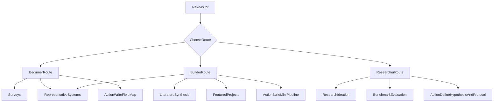

# Vibe Research Starter Packet

## 🌐 Multilingual Version / 多语言版本

**[View interactive multilingual README (13 languages) →](https://htmlpreview.github.io/?https://raw.githubusercontent.com/wang422003/vibe-research-starter-packet/main/index.html)**  
**[查看交互式多语言 README（13 种语言）→](https://htmlpreview.github.io/?https://raw.githubusercontent.com/wang422003/vibe-research-starter-packet/main/index.html)**

Languages: 中文 | English | 한국어 | 日本語 | Deutsch | Français | Español | Italiano | Português | العربية | ไทย | Tiếng Việt | Русский

> *Or clone the repo and open `index.html` in your browser for the best experience.*  
> *或克隆仓库后在浏览器中打开 `index.html` 以获得最佳体验。*

---

> A curated bilingual (CN/EN) starter packet for **Vibe Research**: LLM agents for scientific discovery, research ideation, literature synthesis, and scientific evaluation.
>
> 一个面向 **Vibe Research** 的中英双语入门资料包，聚焦 LLM Agent 在科学发现、研究构思、文献综合与科研评测中的代表性工作。

## 30-Second Quickstart

1. Start with the **Recommended Reading Path** and finish the first 3 surveys.
2. Pick one direction from **Systems / Ideation / Benchmark** and deep-dive 2 papers.
3. Open one issue using `Resource Suggestion` to share a missing paper or toolkit.

If you only have 30 minutes today: read Paper #1 + #4 + #12.

## Table of Contents

- [What is Vibe Research?](#what-is-vibe-research)
- [Who is this for?](#who-is-this-for)
- [Awesome-Style Route Cards](#awesome-style-route-cards)
- [Visual Route Map](#visual-route-map)
- [30-Second Quickstart](#30-second-quickstart)
- [Recommended Reading Path](#recommended-reading-path)
- [Legend](#legend)
- [Curated Reading List](#curated-reading-list)
  - [1) Surveys](#1-surveys)
  - [2) Representative Systems](#2-representative-systems)
  - [3) Research Ideation](#3-research-ideation)
  - [4) Literature Synthesis](#4-literature-synthesis)
  - [5) Benchmark and Evaluation](#5-benchmark-and-evaluation)
- [Featured Projects and Repos](#featured-projects-and-repos)
- [Weekly Changelog](#weekly-changelog)
- [How to Contribute](#how-to-contribute)
- [Curation Principles](#curation-principles)
- [License](#license)

## What is Vibe Research?

**EN**: Vibe Research studies how LLM-based agents can support or automate the full research loop: finding ideas, planning experiments, writing code, synthesizing literature, and validating scientific insights.

**中文**：Vibe Research 关注 LLM Agent 如何支持或自动化完整科研流程：从 idea 发现、实验规划与实现，到文献综合和科研结论验证。

## Who is this for?

- Newcomers who want a structured entry point into AI-for-science agents
- Graduate students looking for paper-reading and project directions
- Builders who want to prototype research copilots or autonomous research systems

## Awesome-Style Route Cards

Pick one route based on your goal. Each route gives you a focused paper stack and a practical next action.

### Beginner Route

> **Goal**: Build a clean mental model of the field in one weekend.

- Start with: [From Automation to Autonomy](https://arxiv.org/abs/2505.13259), [LLM Agents as AI Scientists](https://openreview.net/pdf?id=bfdUWy6rUA), [A Survey of LLM-based Scientific Agents](https://arxiv.org/abs/2503.24047)
- Then read: [The AI Scientist](https://arxiv.org/abs/2408.06292)
- Next action: Write a 1-page map: `problem -> agent role -> evaluation`
- Jump to: [Surveys](#1-surveys), [Representative Systems](#2-representative-systems)

### Builder Route

> **Goal**: Move from reading to building a prototype research copilot.

- Start with: [The AI Scientist](https://arxiv.org/abs/2408.06292), [The AI Scientist-v2](https://arxiv.org/abs/2504.08066), [Agent Laboratory](https://arxiv.org/abs/2501.04227)
- Pair with: [OpenScholar](https://arxiv.org/abs/2411.14199)
- Next action: Implement a minimal pipeline: `retrieve papers -> draft idea -> run tiny experiment -> summarize`
- Jump to: [Representative Systems](#2-representative-systems), [Literature Synthesis](#4-literature-synthesis), [Featured Projects and Repos](#featured-projects-and-repos)

### Researcher Route

> **Goal**: Design publishable research questions and evaluate rigorously.

- Start with: [ResearchAgent](https://arxiv.org/abs/2404.07738), [Can LLMs Generate Novel Research Ideas?](https://arxiv.org/abs/2409.04109), [Chain of Ideas](https://arxiv.org/abs/2410.13185), [Scideator](https://arxiv.org/abs/2409.14634)
- Evaluate with: [ScienceAgentBench](https://arxiv.org/abs/2410.05080), [FIRE-Bench](https://arxiv.org/abs/2602.02905), [AstaBench](https://arxiv.org/abs/2510.21652)
- Next action: Define one hypothesis and one benchmark-backed evaluation protocol
- Jump to: [Research Ideation](#3-research-ideation), [Benchmark and Evaluation](#5-benchmark-and-evaluation)

## Visual Route Map

A quick map from visitor intent to reading categories and concrete actions:

## Recommended Reading Path

If you are new, follow this path first:

1. From Automation to Autonomy
2. LLM Agents as AI Scientists
3. A Survey of LLM-based Scientific Agents
4. The AI Scientist
5. The AI Scientist-v2
6. Agent Laboratory
7. ResearchAgent
8. Can LLMs Generate Novel Research Ideas?
9. Chain of Ideas
10. Scideator
11. OpenScholar
12. ScienceAgentBench
13. FIRE-Bench
14. AstaBench

## Legend

- **Recommendation**: `★★★★★` (must-read), `★★★★☆` (strongly recommended)
- **Stage**:
  - `Beginner`: first contact with the topic
  - `Beginner-Intermediate`: bridge to systems and methods
  - `Intermediate`: can support project design and implementation

## Curated Reading List

### 1) Surveys

| # | Paper | Type | Why read | Stage | Keywords |
|---|---|---|---|---|---|
| 1 | [From Automation to Autonomy: A Survey on Large Language Models in Scientific Discovery](https://arxiv.org/abs/2505.13259) | Survey | Global map of evolution from tool to analyst to scientist; excellent first paper. | Beginner | LLM4Science, evolution |
| 2 | [LLM Agents as AI Scientists: A Survey](https://openreview.net/pdf?id=bfdUWy6rUA) | Survey | Covers end-to-end pipeline: hypothesis, experiment, writing, and review. | Beginner | AI Scientist, lifecycle |
| 3 | [A Survey of LLM-based Scientific Agents](https://arxiv.org/abs/2503.24047) | Survey | Strong systems perspective: benchmark, architecture, applications, ethics. | Beginner-Intermediate | system design, benchmark |

### 2) Representative Systems

| # | Paper | Type | Why read | Stage | Keywords |
|---|---|---|---|---|---|
| 4 | [The AI Scientist: Towards Fully Automated Open-Ended Scientific Discovery](https://arxiv.org/abs/2408.06292) | System | Landmark end-to-end automation system for scientific discovery. | Intermediate | AI Scientist, workflow |
| 5 | [The AI Scientist-v2: Workshop-Level Automated Scientific Discovery via Agentic Tree Search](https://arxiv.org/abs/2504.08066) | System | Adds stronger autonomy with agentic tree search. | Intermediate | tree search, autonomy |
| 6 | [Agent Laboratory: Using LLM Agents as Research Assistants](https://arxiv.org/abs/2501.04227) | System | Practical human-in-the-loop setup for real-world research usage. | Intermediate | copilot, human feedback |

### 3) Research Ideation

| # | Paper | Type | Why read | Stage | Keywords |
|---|---|---|---|---|---|
| 7 | [ResearchAgent: Iterative Research Idea Generation over Scientific Literature with Large Language Models](https://arxiv.org/abs/2404.07738) | Ideation | Iterative idea generation grounded in literature and gap discovery. | Intermediate | ideation, iteration |
| 8 | [Can LLMs Generate Novel Research Ideas? A Large-Scale Human Study with 100+ NLP Researchers](https://arxiv.org/abs/2409.04109) | Evaluation / Ideation | Large-scale human study on novelty and feasibility of generated ideas. | Intermediate | novelty, feasibility |
| 9 | [Chain of Ideas: Revolutionizing Research Via Novel Idea Development with LLM Agents](https://arxiv.org/abs/2410.13185) | Ideation | Organizes literature with Chain-of-Ideas and Idea Arena mechanisms. | Intermediate | Chain-of-Ideas, organization |
| 10 | [Scideator: Human-LLM Scientific Idea Generation Grounded in Research-Paper Facet Recombination](https://arxiv.org/abs/2409.14634) | Human-LLM Ideation | Mixed-initiative ideation and novelty checking via facet recombination. | Intermediate | mixed-initiative, novelty check |

### 4) Literature Synthesis

| # | Paper | Type | Why read | Stage | Keywords |
|---|---|---|---|---|---|
| 11 | [OpenScholar: Synthesizing Scientific Literature with Retrieval-Augmented Language Models](https://arxiv.org/abs/2411.14199) | RAG / Synthesis | Strong example of citation-backed scientific literature synthesis. | Intermediate | RAG, grounded synthesis |

### 5) Benchmark and Evaluation

| # | Paper | Type | Why read | Stage | Keywords |
|---|---|---|---|---|---|
| 12 | [ScienceAgentBench: Toward Rigorous Assessment of Language Agents for Data-Driven Scientific Discovery](https://arxiv.org/abs/2410.05080) | Benchmark | Rigorous evaluation for data-driven scientific discovery agents. | Intermediate | evaluation rigor, authenticity |
| 13 | [FIRE-Bench: Evaluating Agents on the Rediscovery of Scientific Insights](https://arxiv.org/abs/2602.02905) | Benchmark | Tests whether agents can rediscover verifiable scientific insights. | Intermediate | rediscovery, verification |
| 14 | [AstaBench: Rigorous Benchmarking of AI Agents with a Scientific Research Suite](https://arxiv.org/abs/2510.21652) | Benchmark | Larger-scale and more holistic scientific research benchmark suite. | Intermediate | holistic benchmark, suite |

## Featured Projects and Repos

Useful starting points if you want to move from reading to building:

- [The AI Scientist (Sakana AI)](https://github.com/SakanaAI/AI-Scientist)
- [OpenScholar](https://github.com/allenai/OpenScholar)
- [Paper with Code: AI for Science](https://paperswithcode.com/task/ai-for-science)
- [Papers with Code: Automated Machine Learning](https://paperswithcode.com/task/automl)

## How to Contribute

- Suggest a resource via GitHub Issue template: `Resource Suggestion`
- Submit updates through Pull Requests with complete metadata
- Follow criteria in [`docs/curation-guidelines.md`](docs/curation-guidelines.md)

## Weekly Changelog

This section tracks weekly updates so returning readers can quickly spot new additions.
Full history: [`CHANGELOG.md`](CHANGELOG.md)

| Week | Highlights |
|---|---|
| 2026-W12 | Initial public release of the starter packet, bilingual README, and contribution workflow. |
| Next | Add one `System` paper + one `Benchmark` paper with concise newcomer notes. |

## Curation Principles

We prioritize papers and resources that are:

1. Relevant to LLM agents in scientific workflows
2. Representative in methodology, scale, or influence
3. Clear about evaluation design and claims
4. Useful for newcomers building practical understanding

## License

MIT (see `LICENSE`).
